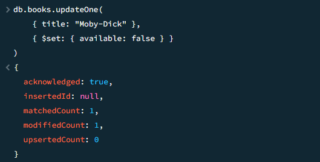

| Question | Output |
|-----------|--------|
|1. Create a Database Library.||
|3. Insert some sample documents into the ‘books’ collection.||
|4. Find all documents in the ‘books’ collection.||
|5. Find books published after 1950.||
|6. Find a book by title.||
|7. Update the year published for "The Great Gatsby".||
|8. Update the available status of "Moby-Dick" to false.||
|9. Set a new field checked_out to false for all available books.||
|10. Change the checked_out status to true for books in the "Adventure" genre. ||
|11. Delete a book by title. ||
|12. Delete all books published before 1930. ||

