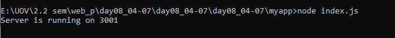
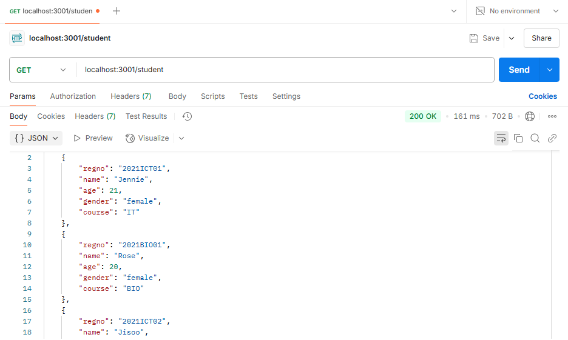
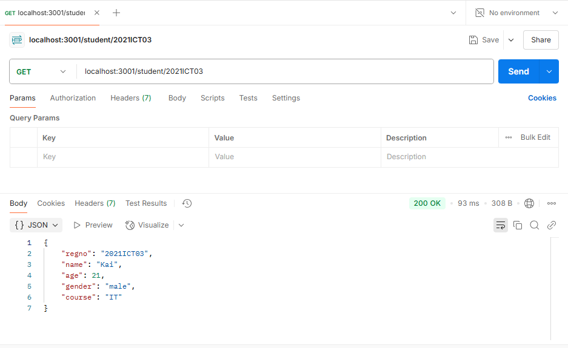
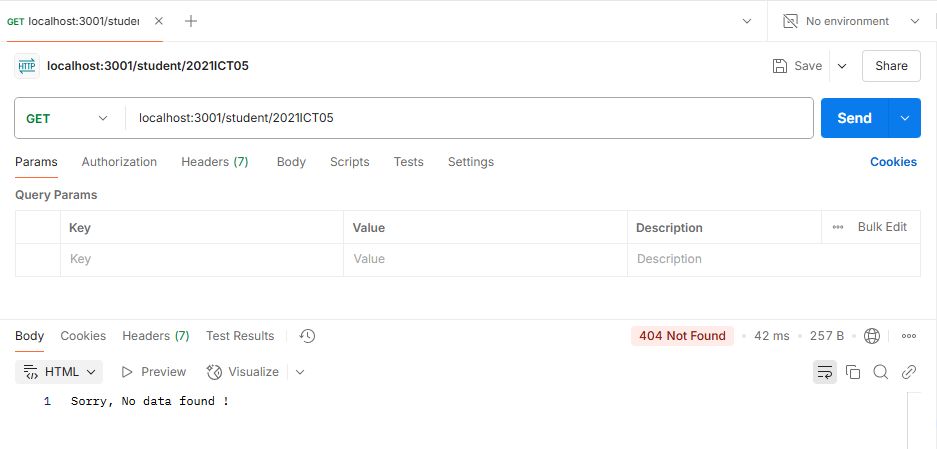
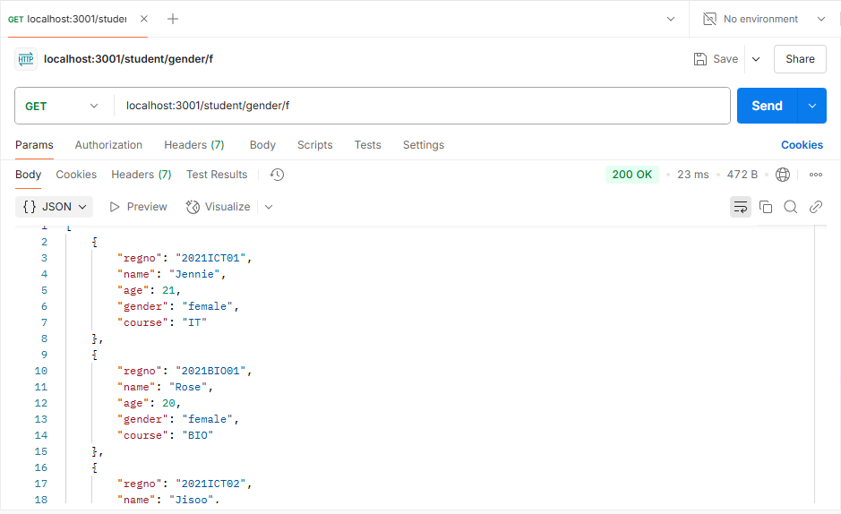
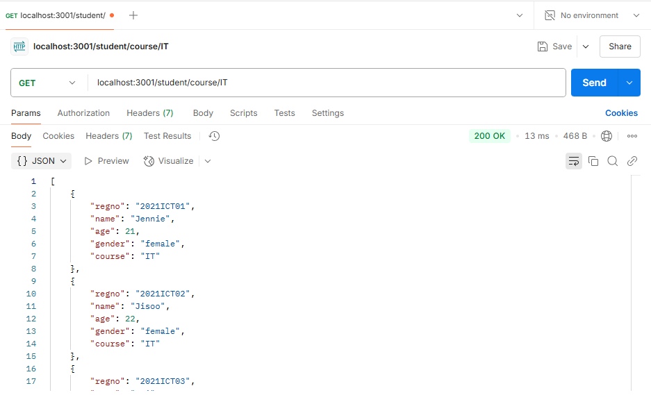

| Code File | Output |
|-----------|--------|
|[index.js](./Codes/index.js)          [studentdb.js](./Codes/studentdb.js)            [studentroute.js](./Codes/studentroute.js)                     [studentservice.js](./Codes/studentservice.js)||
