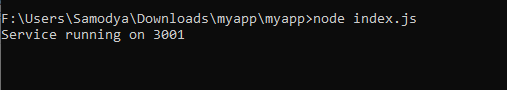
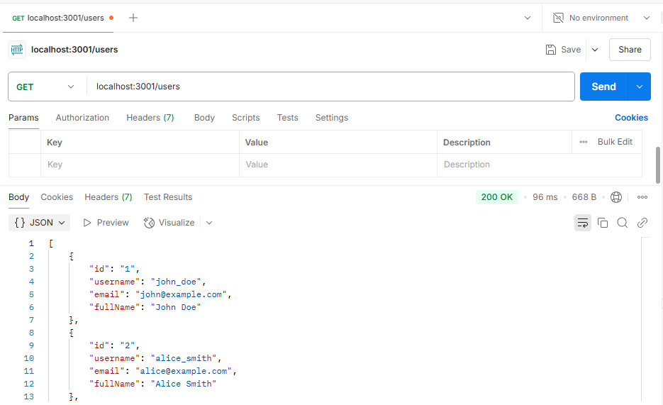
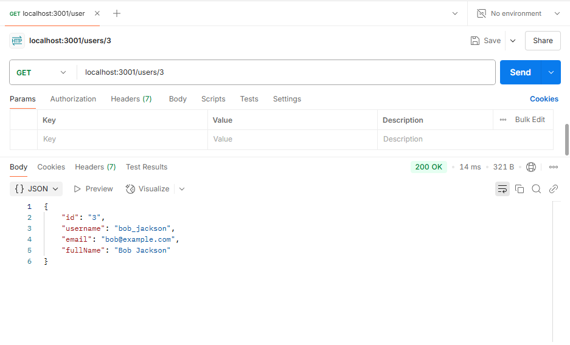
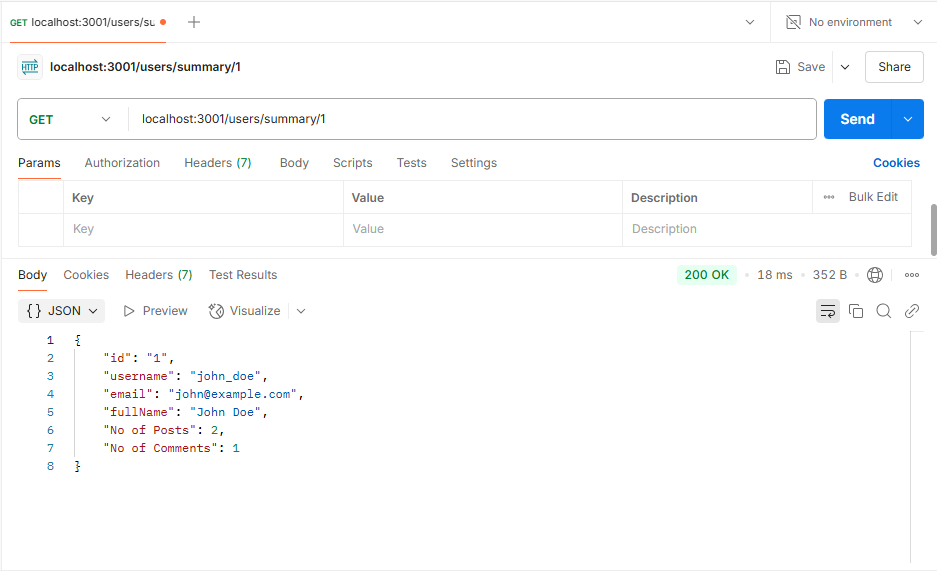
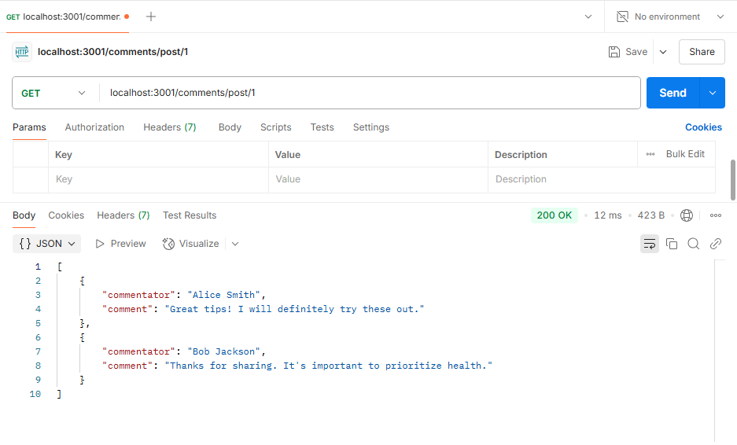
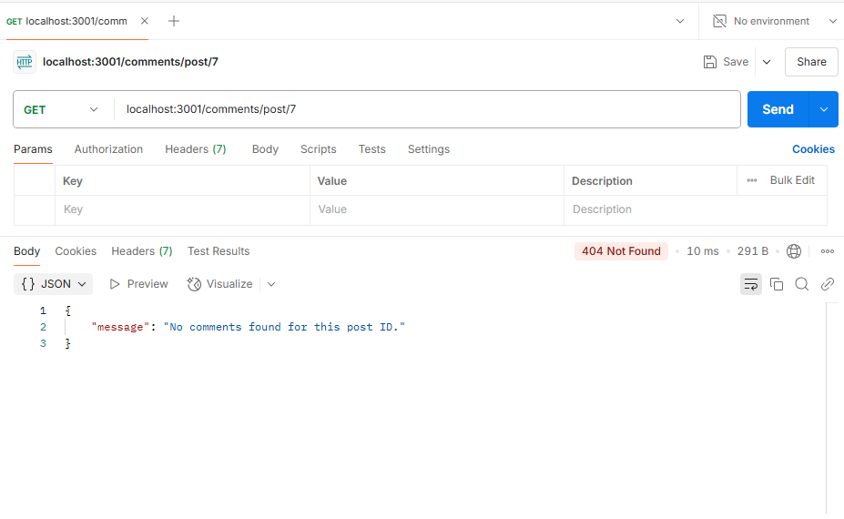

| Code File | Output |
|-----------|--------|
|[users.js](./Codes/users.js) [userservice.js](./Codes/userservice.js)   [userroute.js](./Codes/userroute.js)   [comments.js](./Codes/users.js) [commentsservice.js](./Codes/commentsservice.js) [commentroute.js](./Codes/commentroute.js) [posts.js](./Codes/posts.js) [postsservice.js](./Codes/postsservice.js)||

