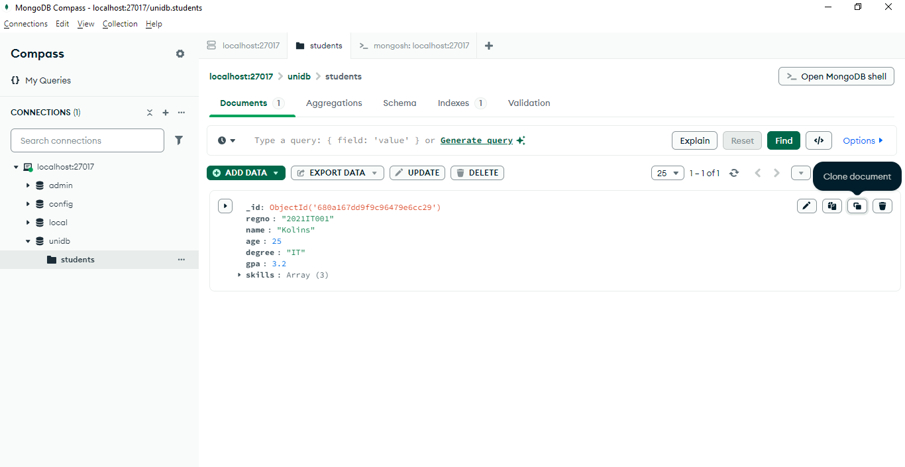

# 🛠️ MongoDB Tutorial

This tutorial covers how to connect, create databases, insert and manipulate data in MongoDB through the UI and shell.

---

## 📋 Table of Contents

1. [Adding a New Connection](#adding-a-new-connection)
2. [Creating a Database](#creating-a-database)
4. [Using MongoDB Shell](#using-mongodb-shell)
5. [Basic Shell Commands](#basic-shell-commands)
6. [Inserting Data via UI](#inserting-data-via-ui)
7. [Editing and Cloning Documents](#editing-and-cloning-documents)
8. [Inserting Data via Shell](#inserting-data-via-shell)
9. [Finding Students](#finding-students)

---

## 🧩 Adding a New Connection 

- Open MongoDB Compass.
- Click the **"Add New Connection"** button to set up a new database connection.


- After entering your server details, click **"Save & Connect"**.
  

- Now the connection is created.
  

## 🗃️ Creating a Database

- Click **"Create Database"**.
- Enter the **Database Name** and **Collection Name**.
- Click **"Create Database"** to confirm.
  

- Now the database is created.
  

## 💻 Using MongoDB Shell

- Click the **"Open MongoDB Shell"** button.
- You can now execute MongoDB commands directly from the shell.
  

---

## ⚙️ Basic Shell Commands

```bash
# Change the database
use unidb

# Show all databases
show databases

# Show collections in the current database
show collections

# Clear the shell screen
cls
```
  


## 🛠️ Inserting Data via UI
- Click "Add Data" → "Insert Document".


- Enter the document details.


- Click "Format" to format the document properly.
- Click "Insert" to save it.

  

- Now the data will be inserted.
  


## Clone a Document
- Click "Clone Document" to create a duplicate and modify if needed.
  

## ✏️ Editing Documents
- Click "Edit Document".
   
- Click the "+" button to add fields.
   
Example: Add a "gender" field and click "Update".
 

## 🔥 Inserting Data via MongoDB Shell

### Insert One Document
```javascript
db.students.insertOne({
  "regno": "2021IT003",
  "name": "Niki",
  "age": 21,
  "degree": "IT",
  "gpa": 3.5,
  "skills": ["JS", "MySQL", "Java"],
  "gender": "male"
})
```


### Insert Many Document
```javascript
db.students.insertMany([
  {
    "regno": "2021IT004",
    "name": "Jisoo",
    "age": 24,
    "degree": "IT",
    "gpa": 3.8,
    "skills": ["JS", "MySQL", "C"],
    "gender": "male"
  },
  {
    "regno": "2021IT005",
    "name": "Rose",
    "age": 22,
    "degree": "IT",
    "gpa": 3.7,
    "skills": ["JS", "MySQL", "MongoDb"],
    "gender": "male"
  }
])
```


## 💻 Display Students

### Display Name and Age With ID
{name:1, age:1}


### Display Name and Age Without ID
{name:1, age:1, _id:0}


- Click "Reset" to clear the filters.


### List View


### Table View


## 🔎 Find Students

### Find Student using Registration Number
{regno:"2021IT004"}


### Find Students using gender
{gender:"female"}


db.students.find({"gender":"female"})


### Find 1st female student
db.students.findOne({"gender":"female"})


### Find students whose age is greater than 25

{age:{$gt:25}}


db.students.find({"age":{$gt:25}})


### Find students whose age is less than 25
{age:{$lt:25}}


### Find students whose age is equal to 25
{age:{$eq:25}}


### Find students who have skills in MongoDb
{skills:"MongoDb"}


{skills:{$in:["MongoDb"]}}


### Find students who have skills in C or Java
{skills:{$in:["C", "Java"]}}


### Find students who don't have skills in MongoDb
{skills:{ $nin:["MongoDb"]}}


## 🛠️ Sort Students
### Sort students by gpa (Descending order)
{ gpa: -1 }


### Sort students by gpa and name
{ name: 1, age: 1 }


### Sort students by gpa (Ascending order) via shell
db.students.find().sort({'gpa':1})


### Sort students by gpa (Descending order) via shell
db.students.find().sort({'gpa':-1})


### Find IT male students sort by gpa (Descending order) via shell
db.students.find({'degree':'IT','gender':'male'}).sort({'gpa':1})


