# 🛠️ MongoDB Practical 11-28

## 🧩 Delete DataBase
- db.dropDatabase()
  
  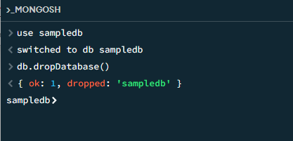
   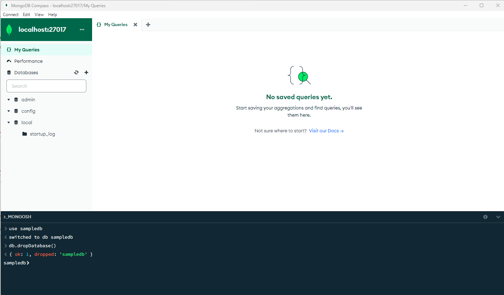

## 🗃️ Delete Collection
- db.sampledata.drop()

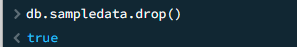

## 🔥 Delete data by ID
- db.degree.deleteOne({_id:ObjectId('680ee994a6a40ec6c45a9682')})
  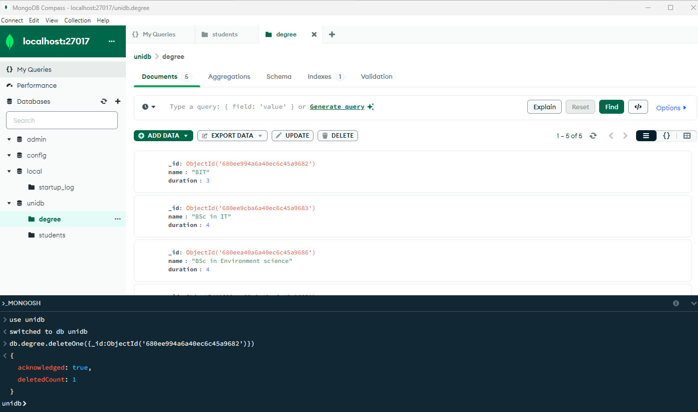

## 💻 Display the degree programs
- db.degree.find().projection(['name','duration'])
  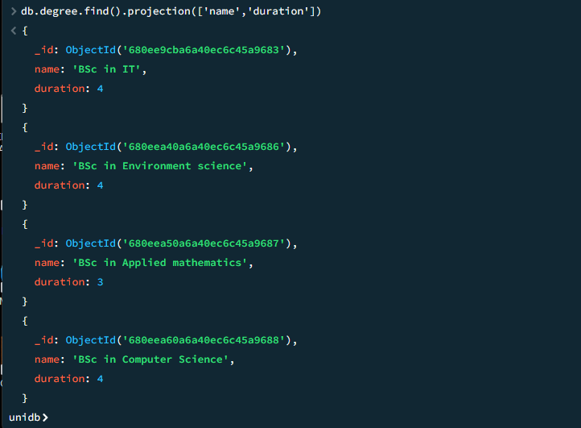
- db.degree.find({},{name:1,_id:0}).pretty()
  
   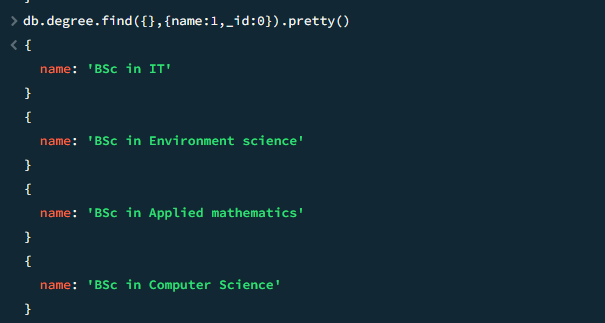

## 🔥 Delete the degrees
### Delete the degree which duration is less than 04
- db.degree.deleteMany({duration:{$lt:4}})

### Display the remaining
- db.degree.find({},{name:1,duration:1,_id:0}).pretty()

   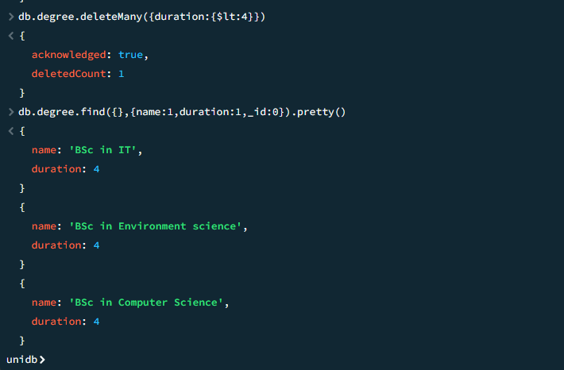

## ✏️ Update the details of one degree using Id
- db.degree.updateOne({_id:ObjectId('680eef5ea6a40ec6c45a968e')},{$set:{name:'BIT',duration:3}})
   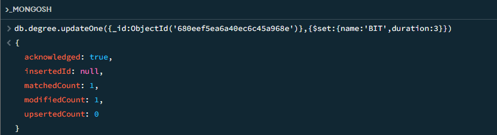

## 🔎 Find the degree using Id
- db.degree.findOne({_id:ObjectId('680eef5ea6a40ec6c45a968e')})
   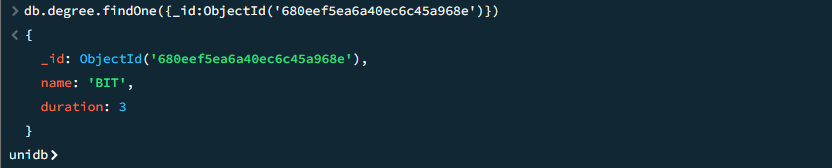

## ✏️ Update by adding 1 year to the degrees which duration is greater than or equal to 4
- db.degree.updateMany({duration:{$gte:4}},{$inc:{duration:1}})
   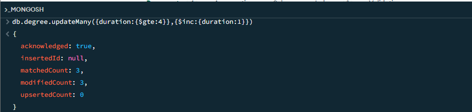

  ## 💻 Display all degrees
  - db.degree.find()
    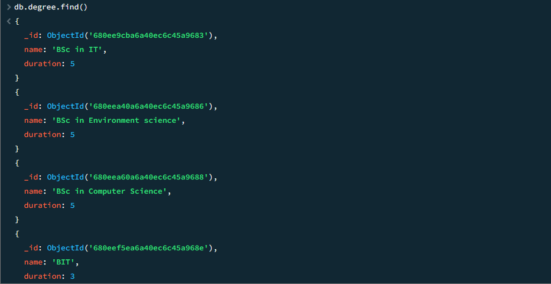

    ## ⚙️  Add new skill to student using regno
  - db.students.updateOne({regno:'2021IT001'},{$push:{skills:'PHP'}})

    ### Display student using regno
  - db.students.findOne({regno:'2021IT001'})
     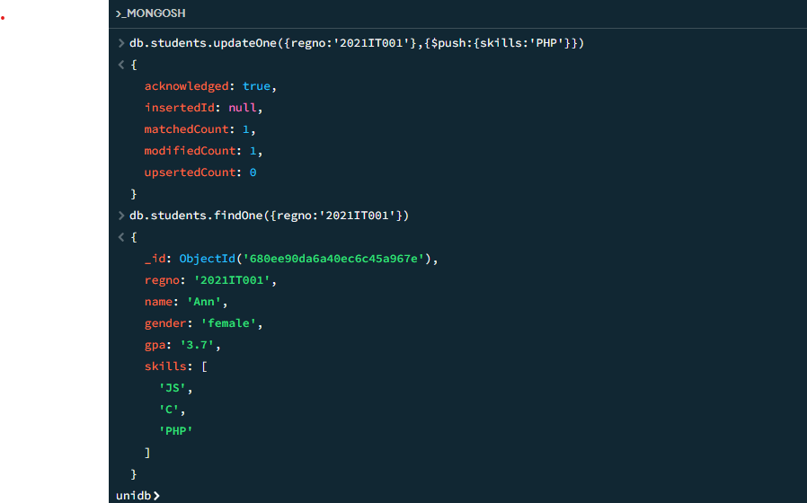
